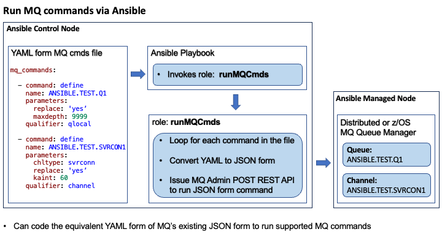

# IBM MQ Ansible Collection to issue YAML form commands
The **IBM MQ Ansible YAML Commands Collection** consists of sample **Ansible Playbooks** that invoke a **runMQCmds** role to issue **YAML form** MQ commands to administer **distributed** or **z/OS** MQ Queue Managers.

The use of playbooks provides for **automation**, and for the possibility to run playbooks as part of a **Continuous Integration and Continuous Delivery/Continuous Deployment (CI/CD) pipeline**.

Ansible Playbooks are typically run on an **Ansible Control node**. Code in a playbook acts on resources in an **Ansible Managed node**. For example, Ansible may be installed on a laptop so that the laptop can act as an Ansible control node. Playbooks can then be run on this control node to manage resources on a remote managed node.

The runMQCmds role converts YAML to JSON, and invokes the **IBM MQ Administrative POST REST API** to issue **JSON form MQSC commands** on target MQ queue managers. Commands and their attributes are specified as **key/value pairs** in a **cmds input file**. The key/value pairs are identical to those currently documented for the MQ REST APIs. The following diagram shows the flow:



Being able to represent IBM MQ commands in YAML form provides for a **modern approach** with simple key/value pairs. Users can define cmds files using their favourite YAML editors. Editors may include user-defined templates or schemas to limit typographical errors and perform pre-command-execution validation. If cmds files are stored in a source control management system (scm), users can also benefit from version control.

In order to run the sample playbooks, users will need to run perform the customization steps mentioned in the **Getting Started** section below.

## Playbook Summary
The following sample MQ playbooks run on a control node to issue YAML form MQ commands against MQ queue managers on managed nodes. The playbooks demonstrate:

1. [**run_mq_crud_yaml_cmds.yml**](playbooks/run_mq_crud_yaml_cmds.yml) - # the simplest form of invocation of the runMQCmds role to run various YAML form MQ CRUD commands specified in a default cmds input file.
2. [**run_mq_cfstruct_yaml_cmds.yml**](playbooks/run_mq_cfstruct_yaml_cmds.yml) - # an invocation of the runMQCmds role with arguments, to run YAML form MQ CF structure commands specified in a cmds input file.
3. [**run_mq_comms_yaml_cmds.yml**](playbooks/run_mq_comms_yaml_cmds.yml) - # multiple invocations of the runMQCmds role with varying arguments, to run YAML form MQ commands specified in multiple cmds input files at sending and receiving queue managers.
4. [**run_mq_chlauth_yaml_cmds.yml**](playbooks/run_mq_chlauth_yaml_cmds.yml) - # an invocation of the runMQCmds to run YAML form MQ channel authentication rule commands specified in a cmds input file. As described in comments in this playbook, argument overrides are specified with the '-e' (extra variables) option when running the playbook.
5. [**run_mq_start_stop_yaml_cmds.yml**](playbooks/run_mq_start_stop_yaml_cmds.yml) - # an invocation of the runMQCmds role with arguments, to run YAML form MQ start and stop commands specified in a cmds input file.
6. [**run_mq_clus_qmgr_yaml_cmds.yml**](playbooks/run_mq_clus_qmgr_yaml_cmds.yml) - # an invocation of the runMQCmds role with arguments, to run YAML form MQ cluster queue manager commands specified in a cmds input file.
7. [**run_mq_display_qmgr_yaml_cmds.yml**](playbooks/run_mq_display_qmgr_yaml_cmds.yml) - # an invocation of the runMQCmds role with argument overrides specified in a variable file (vars_file) included in the playbook, to run YAML form MQ cluster queue manager commands specified in a cmds input file.

Users can use playbook [**run_mq_user_yaml_cmds.yml**](playbooks/run_mq_user_yaml_cmds.yml) to set argument overrides specific to their environments, and invoke the runMQCmds role against their own MQ cmds file.

## cmds file summary
A cmds file contains a YAML array named **mq_commands:**, of one or more MQ commands. Each command is defined as **- command:**. This can be seen in the above flow diagram and in the sample cmds files listed below.

Commands and their attributes are specified as key/value pairs that are identical to those that can be specified when using the IBM MQ administrative POST REST API to issue JSON format MQSC commands. Therefore, the YAML representation of **any** JSON formatted MQSC commands supported by the POST REST API can be specified in an input cmds file: see [**Post - JSON formatted command**](https://www.ibm.com/docs/en/ibm-mq/9.3?topic=adminactionqmgrqmgrnamemqsc-post-json-formatted-command) for a list of supported commands.

The following sample cmds files, which are processed by the respective playbooks listed above, are provided:

1. [**mq_crud_yaml_cmds.yml**](cmds_files/mq_crud_yaml_cmds.yml) - # This is defined as the default cmds file to use.
2. [**mq_cfstruct_yaml_cmds.yml**](cmds_files/mq_cfstruct_yaml_cmds.yml)
3. (a) [**mq_sending_end_yaml_cmds.yml**](cmds_files/mq_sending_end_yaml_cmds.yml) - # Processed by run_mq_comms_yaml_cmds.yml.

   (b) [**mq_receiving_end_yaml_cmds.yml**](cmds_files/mq_receiving_end_yaml_cmds.yml) - # Processed by run_mq_comms_cmds.yml.
4. [**mq_chlauth_yaml_cmds.yml**](cmds_files/mq_chlauth_yaml_cmds.yml)
5. [**mq_start_stop_yaml_cmds.yml**](cmds_files/mq_start_stop_yaml_cmds.yml)
6. [**mq_clus_qmgr_yaml_cmds.yml**](cmds_files/mq_clus_qmgr_yaml_cmds.yml)
7. [**mq_display_qmgr_yaml_cmds.yml**](cmds_files/mq_display_qmgr_yaml_cmds.yml)

The sample commands in these files provide examples of the required YAML syntax.

Users can add their own YAML form MQ commands in [**mq_user_yaml_cmds.yml**](cmds_files/mq_user_yaml_cmds.yml) and run them using playbook [**run_mq_user_yaml_cmds.yml**](playbooks/run_mq_user_yaml_cmds.yml).

## runMQCmds role Summary
The **runMQCmds** role reads YAML form IBM MQ commands and invokes the **IBM MQ Administrative POST REST API** to issue JSON formatted MQSC commands against MQ queue managers. 

The runMQCmds role can be invoked in Ansible playbooks in a simple form with default arguments, or it can be invoked with one or more **argument overrides** supported by the runMQCmds role. Refer to the README.md file for the runMQCmds role for further information.

The sample playbooks listed above demonstrate some different ways in which arguments can be specified/passed. However, Ansible supports a hierarchy of twenty-two variable precedence rules: see: [**Understanding variable precedence**](https://docs.ansible.com/ansible/latest/playbook_guide/playbooks_variables.html#understanding-variable-precedence). Therefore, there are other ways of specifying arguments. Users will need to decide on what works best for their environments.

## ansible.cfg file
- An Ansible Configuration file, [**ansible.cfg**](ansible.cfg), with the following contents is shipped in the collection directory:
```
[defaults]
# Python Interpreter
python_interpreter=/opt/homebrew/bin/python3.11
# Local host inventory file
inventory = inventories/localhost.ini
# Roles path
roles_path = roles
# Format any output produced in yaml form
stdout_callback=yaml
# Limit output when running an Ansible playbook by not displaying "Skipping [host]" messages
display_skipped_hosts=False
```

- For more information see: [**Ansible Configuration Settings**](https://docs.ansible.com/ansible/latest/reference_appendices/config.html) and note the search order for configuration files.

## Python 3 Interpreter
  Ansible will automatically detect and use Python 3 on many platforms that ship with it. 
  
  To explicitly configure a Python 3 Interpreter, set its location in one, or both, of the following:

  - **python_interpreter** variable in the **ansible.cfg** (as shown above).
  - **ansible_python_interpreter** inventory variable at a **group** or **host** level (as shown in the [**localhost.ini**](inventories/localhost.ini) file mentioned below).

  For more information on python configuration requirements on z/OS, see [**Ansible Frequently Asked Questions: Running on z/OS**](https://docs.ansible.com/ansible/latest/reference_appendices/faq.html).

## Inventory file
- [**localhost.ini**](inventories/localhost.ini) - a local host file to specify the **Ansible connection** and **Python interpreter** settings, and to prevent **Ansible warning messages** about **implicit localhost** and/or **Python interpreter**.

  By default, the inventory file as specified in the supplied **ansible.cfg** file is used. However, users can specify an alternate inventory file by changing the setting in **ansible.cfg** or by using the **-i option** to specify the path to the **alternate inventory file** when running a playbook. For example, users can define a **myhosts.yml** file in the **inventories** folder and issue:
  ```
  ansible-playbook playbooks/run_mq_cluster_cmds.yml -i inventories/myhosts.yml
  ```

## Ansible Collection Requirements
- Standard [**Ansible.builtin**](https://docs.ansible.com/ansible/latest/collections/ansible/builtin/index.html) modules.

## Dependencies
- A **mqweb server** needs to be configured and running so that the runMQCmds role can issue MQ REST API calls: see [**Administration using the REST API**](https://www.ibm.com/docs/en/ibm-mq/9.3?topic=administering-administration-using-rest-api).

## Getting Started
- Ensure that the dependencies stated above have been configured.
- Configure Ansible on a control node so that playbooks can be run on the control node to administer resources on a managed node: see [**Getting started with Ansible**](https://docs.ansible.com/ansible/latest/getting_started/index.html).
- See [**Ansible playbooks**](https://docs.ansible.com/ansible/latest/playbook_guide/playbooks_intro.html) for more information about playbooks.
- Get this collection from [**ibm-messaging/mq-ansible-yaml-commands**](https://github.com/ibm-messaging/mq-ansible-yaml-commands)

    The files for the collection are stored in the Ansible defined directory structures for [**Collection directories and files**](https://docs.ansible.com/ansible/latest/dev_guide/developing_collections_structure.html#collection-directories-and-files) and [**Role directory structure**](https://docs.ansible.com/ansible/latest/playbook_guide/playbooks_reuse_roles.html#role-directory-structure). 
    
    For the MQ collections to function correctly, it is important that users keep to these directory structures.
- Perform the following customization steps **as required**: 

  1. Set any argument overrides, on the invocation of role runMQCmds. Some default values set for the role like **webserver_addr and qmgr_name** will not be valid for user environments. As Ansible recommends that users do not change the supplied default values, the sample playbooks show numerous ways of customizing the default values by specifying them as argument overrides on the runMQCmds role. However, given the nature of some argument values, it would be acceptable for users to replace the supplied default values in **defaults/main.yml** with user-specific values as this may help reduce administrative overhead.

  2. Update the REST API call invocation in [**prepare_and_run_mq_cmd.yml**](./roles/runMQCmds/tasks/prepare_and_run_mq_cmd.yml) if a different type of authentication is to be used: see: [**IBM MQ Console and REST API security**](https://www.ibm.com/docs/en/ibm-mq/9.3?topic=securing-mq-console-rest-api-security) for further information.

  3. Update the samples, or create new cmds and playbook files, to specify and run MQ commands specific for user MQ environments.

      Where applicable, remember to replace any **host name** and **port number** values with specific values for user environments.

  4. Update the **inventories/localhost.ini** file.

- Run the sample playbooks as described below.

## Running the playbooks
Change to the directory for the collection, [**mq_ansible_yaml_commands_collection**](../mq_ansible_yaml_commands_collection), and issue one of the following commands:

1. MQ CRUD commands sample playbook, issue:
    ```
    ansible-playbook playbooks/run_mq_crud_yaml_cmds.yml
    ```
2. MQ CF structure commands sample playbook, issue:
    ```
    ansible-playbook playbooks/run_mq_cfstruct_yaml_cmds.yml
    ```
3. MQ communications commands sample playbook to define MQ resources at sending and receiving queue managers, issue:
    ```
    ansible-playbook playbooks/run_mq_comms_yaml_cmds.yml
    ```
4. MQ channel authentication rules commands sample playbook, issue:
    ```
    ansible-playbook playbooks/run_mq_chlauth_yaml_cmds.yml -e @playbooks/vars/role_overrides_mq_chlauth_yaml_cmds.yml
    ```
    In this case, the argument overrides are specified in a variable overrides file with the **-e (extra-vars)** option when running the playbook. Ansible requires that the directory for the role overrides file be prepended with the **@ symbol** as shown in the above example.

    **Note**: If the -e option is not specified, commands in the default cmds file are run instead.

5. MQ start and stop commands sample playbook, issue:
    ```
    ansible-playbook playbooks/run_mq_start_stop_yaml_cmds.yml
    ```
6. MQ cluster queue manager commands sample playbook, issue:
    ```
    ansible-playbook playbooks/run_mq_clus_qmgr_yaml_cmds.yml
    ```
7. MQ display queue manager attributes sample playbook, issue:
    ```
    ansible-playbook playbooks/run_mq_display_qmgr_yaml_cmds.yml -vv
    ```
    The **verbose options (-vv or -vvv)** options provides additional information that may be useful for debug purposes.

## Ansible tarball archive file (*.tar.gz) and running playbooks
The following command was issued to build the collection into an archive tarball file called  **ibm-mq_ansible_yaml_commands_collection-1.0.0.tar.gz**:
```
ansible-galaxy collection build
```
The archive file has been supplied to allow users to easily distribute the collection to a remote server, if required. 

The archive file can be installed by issuing the following command:
```
ansible-galaxy collection install ibm-mq_ansible_yaml_commands_collection-1.0.0.tar.gz
```
this will install the collection into the user's **.ansible** directory on the server. For example:
```
/.ansible/collections/ansible_collections/ibm/mq_ansible_yaml_commands_collection
```
**Note:** If for some reason it is necessary to re-install the collection into the same location, the **--force** option may need to be specified to replace the existing installation:
```
ansible-galaxy collection install ibm-mq_ansible_yaml_commands_collection-1.0.0.tar.gz --force
```
As described above, users will need to perform some customization before the playbooks can be run. Users can navigate to the respective directories that were just installed, to customize necessary files.

Once the necessary customization has been performed, users can run the playbooks issuing the following command from any directory:
```
ansible-playbook ibm.mq_ansible_yaml_commands_collection.<playbook_name>
```
Replace **<playbook_name>** with the name of the playbook to be run. For example, to run the Cluster Queue Manager commands sample playbook **run_mq_clus_qmgr_yaml_cmds**, issue the following command:
```
ansible-playbook ibm.mq_ansible_yaml_commands_collection.run_mq_clus_qmgr_yaml_cmds
```
**Note:** When playbooks are run in this way, it is not necessary to specify the **.yml** extention.

## Potential Data Conversion issue with MQ for z/OS Queue Managers
z/OS Systems today are generally shipped with **Code Page (CCSID) 037** installed by default. MQ for z/OS Queue Managers are by default configured with **CCSID(500)**. However, users can (and do) change this to a local CCSID value for their country.

When converting from certain code pages, say **CCSID 500 to UTF8**, a few characters are not converted correctly. For example, an **exclamation mark !** may be converted to a **right square bracket ]**. Or, when **sending data from AIX to z/OS**, an **exclamation mark !** may be converted to a **left square bracket [**. 

While testing the sample playbooks, **MQ for z/OS Queue Manager Command Prefixes** in **REST API response messages** were seen to contain a **right square bracket ]** instead of an **exclamation mark !**. Once the CCSID of the test MQ for z/OS Queue Manager was changed **from 500 to 037**, the command prefix in REST API response messages was converted correctly.

This is a known issue see: [**Exclamation point converted to left square bracket**](https://www.ibm.com/support/pages/exclamation-point-converted-left-square-bracket). 

However, please note that such a change **must be considered carefully** as it **may impact existing business applications**. In some cases, it may be acceptable to tolerate such discrepencies with data conversion.

## Copyright
© Copyright IBM Corporation 2023.

## License
Licensed under [**Apache License**](https://opensource.org/licenses/Apache-2.0).

## Author Information
IBM UK Labs Ltd.